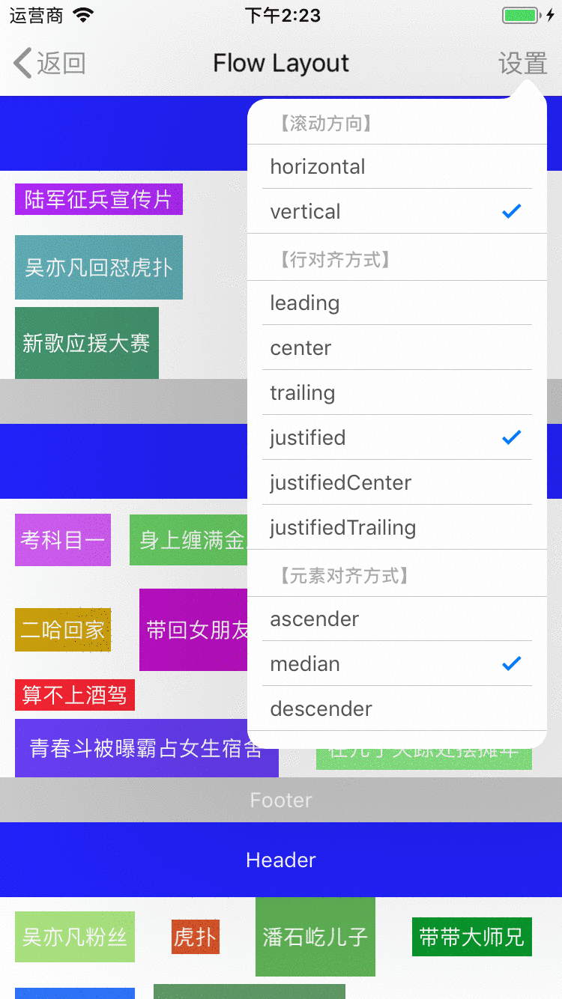

# XZKit

[](https://cocoapods.org/pods/XZKit)
[](http://cocoapods.org/pods/XZKit)
[](http://cocoapods.org/pods/XZKit)
[](http://cocoapods.org/pods/XZKit)

## 环境需求

最低支持 iOS 8.0，推荐 Swift 语言，某些模块在 Objective-C 下不可用。

## 安装集成

可以通过 [CocoaPods](http://cocoapods.org) 快速集成到项目中，也可以直接下载 [XZKit.framework](./Products) 导入到项目中。

```ruby
pod "XZKit"
```

## 组件

- [UICollectionView 自定义流布局：CollectionViewFlowLayout](./Documentation/CollectionViewFlowLayout)

  </img>

- [UIView 内容状态视图：ContentStatusRepresentable](./Documentation/ContentStatusRepresentable)
- [自定义导航条、全屏手势导航控制器：NavigationController](./Documentation/NavigationController)
- [网络层框架：Networking](./Documentation/Networking)
- [控制重定向：AppRedirection](./Documentation/AppRedirection)
- [App 应用内语言切换：AppLanguage](./Documentation/AppLanguage)
- [缓存管理：CacheManager](./Documentation/CacheManager)
- [轮播视图及轮播图：CarouselView](./Documentation/CarouselView)
- [类型拓展：Castable](./Documentation/Castable)
- [常用拓展：Category](./Documentation/Category)
- [框架公共部分：Constant](./Documentation/Constant)
- [数据加密：DataCryptor](./Documentation/DataCryptor)
- [数据摘要：DataDigester](./Documentation/DataDigester)
- [安全列队：DispatchQueue](./Documentation/DispatchQueue)
- [进度视图：ProgressView](./Documentation/ProgressView)
- [文本图片视图：TitledImageView](./Documentation/TitledImageView)

## 联系作者

[mlibai@163.com](mailto://mlibai@163.com)

## License

XZKit is available under the MIT license. See the LICENSE file for more info.
